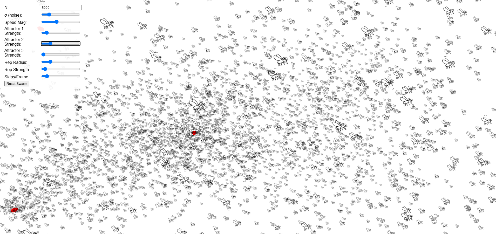

# mozzie_simulator


# Mosquito Swarm Simulator

A fully client-side, agent-based 3D mosquito simulator using Three.js. Male and female agents swarm, feed, and interact with dynamic environmental landmarks. Mosquito sprites (PNG) are rendered as instanced planes for high performance.

---

## Features

- **Agent-based behavior**  
  - **Males:**  
    - Seek sugar, then form swarms over visual markers  
    - Hover, avoid collisions, and mate with incoming females  
  - **Females:**  
    - Initially seek nectar, then enter male swarms to mate  
    - After mating, seek blood-meal hosts, then water to lay eggs  
- **Gravity-like attraction** to attractor points with fixed-speed agents  
- **Short-range repulsion** to prevent overlaps  
- **PNG sprite rendering:** Mosquitoes displayed as transparent 2D planes (`mosquito.png`)  
- **Dynamic landmarks:**  
  - Randomly positioned swarm markers (red spheres)  
  - Nectar patches, host patches, and water bodies (for future extension)  
- **Interactive UI controls** to adjust:  
  - Number of agents (N)  
  - Noise (σ)  
  - Speed magnitude  
  - Attractor strengths (per attractor)  
  - Repulsion radius & strength  
  - Simulation steps per frame

---

## Prerequisites

1. A modern web browser (Chrome, Firefox, Edge, Safari)  
2. A static file server (e.g., VS Code Live Server, Python’s `http.server`, or any localhost server)  
3. Ensure `mosquito.png` sprite is placed alongside `index.html`

You do **not** need any backend or build tools. Everything runs in-browser.

---

## Setup & Usage

1. **Clone or download** this repository to a local folder.  
2. Verify the following files are present in the same directory:  
   - `index.html`  
   - `mosquito.png` (transparent PNG sprite representing a mosquito)

3. **Launch a static server** in that directory. Examples:  
   ```bash
   # Python 3.x
   python -m http.server 8000
